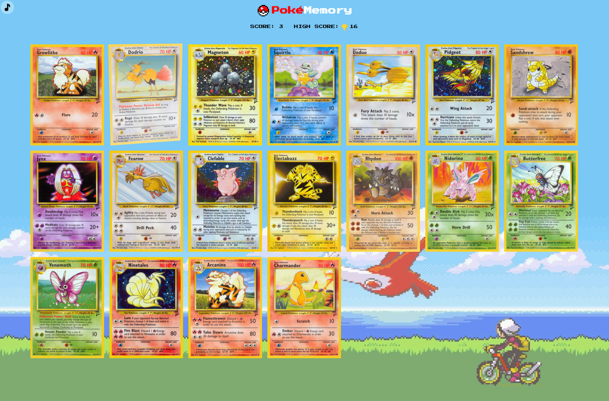

# PokéMemory

A Pokémon-themed memory card game built with React. Test your memory by clicking each card only once — never click the same card twice!



## How to Play

1. Select a difficulty on the start screen
2. Click each card **once** without repeating — the board shuffles after every click
3. Click a card you've already clicked and it's **Game Over**
4. Click every card without repeating to **Win**
5. On a win, choose **Continue** to keep your score and play with 2 extra cards, or **Quit** to return to the start screen

## Difficulty

| Level  | Cards |
|--------|-------|
| Easy   | 5     |
| Medium | 10    |
| Hard   | 18    |

Continuing after a win adds 2 cards each time, with no upper limit.

## Features

- Cards fetched from the [Pokémon TCG API](https://pokemontcg.io/) (Base Set 2, Gen 1)
- 3D card flip animations on every click
- Retro Game Boy-style modals with typewriter text reveal
- Keyboard navigation on all menus (↑ ↓ Enter)
- Persistent best score via localStorage
- Background music player with a shuffled playlist that auto-advances
- Sound effects for card flips, game win, game over, and UI interactions

## Tech Stack

- [React 19](https://react.dev/)
- [TypeScript](https://www.typescriptlang.org/)
- [Vite](https://vitejs.dev/)
- [TanStack Query](https://tanstack.com/query) — data fetching and caching
- [react-parallax-tilt](https://www.npmjs.com/package/react-parallax-tilt) — card tilt effect
- [react-player](https://www.npmjs.com/package/react-player) — background music

## Getting Started

```bash
npm install
npm run dev
```

Then open [http://localhost:5173](http://localhost:5173) in your browser.

## Project Structure

```
src/
├── App.tsx           # Root component, game state
├── GameBoard.tsx     # Card grid, click logic, flip animation
├── GameStart.tsx     # Difficulty select modal
├── GameWon.tsx       # Win modal
├── GameOver.tsx      # Game over modal
├── Header.tsx        # Score display
├── MusicPlayer.tsx   # Background music with shuffled playlist
├── ScoreDisplay.tsx  # Score and best score
├── Typewriter.tsx    # Typewriter text animation
└── sounds.ts         # Sound effect utilities
```
